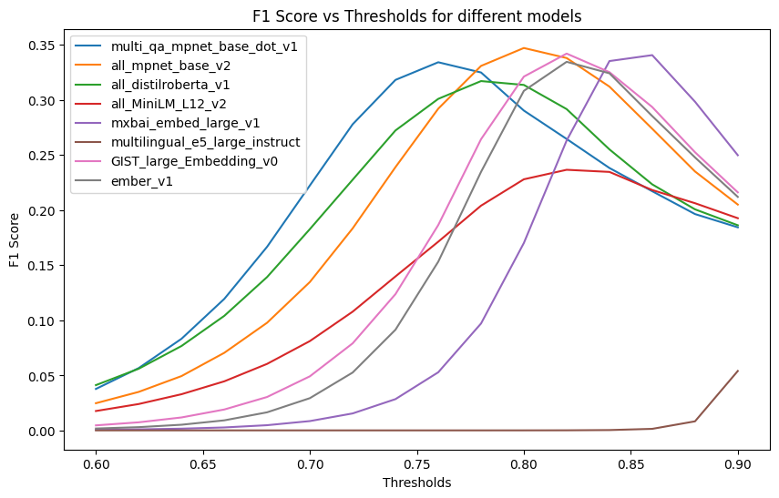

# Document-Level Embeddings for Duplicate GitHub Issue Detection
## Research paper: [Duplicate_GitHub_Ticket_Classification.pdf](https://github.com/kianhk6/Duplicate-GitHub-Ticket-Classification/files/15049474/Duplicate_GitHub_Ticket_Classification.pdf)
## Setup

### Quickstart
Clone this repository

Setting up your virtual environment and installing the required packages:

```
python3 -m venv venv
source venv/bin/activate
pip3 install -r requirements.txt 
```
### Downloading the Dataset
Download the [mozilla_firefox.zip](https://github.com/logpai/bughub/tree/master/Firefox) file, create a `data` folder in the root level of this repository and place the mozilla_firefox.csv file inside of it. Note that it's been manually untracked by the gitignore file because it exceeds the SFU github file limit of 100mb. 

## Overview

Document embeddings serve a purpose in a multitude of tasks including information retrieval, clustering, and pair classification, by enabling semantic similarity comparison between two documents via the cosine similarity operator. This property makes document embeddings useful for detecting duplicate issues in large repositories with backlogs of thousands of issues as an extension of the pair classification task. 

We evaluate 8 document embeddings models for the duplicate detection task within a repository of GitHub issues by computing pair-wise comparisons between issues and evaluating the pair-wise duplicate classification via the F1 metric a number of thresholds. 

We find that the training objective and task, as well as the fine-tune data have the biggest effect on the model's performance, confirming the findings of [Muennighoff et al](https://arxiv.org/abs/2210.07316) that no embedding model dominates across all tasks. 

## Pipeline

To make sure your environment is set up correctly and everything is running as expected, run the `check.ipynb` notebook in the master folder.

If everything executes as expected, you can run the `evaluate_multiple_models.ipynb` notebook.

### Data Configuration
Centralizes configuration settings in `configurations.py`:
- Data paths: `DATA_PATH`, `DATASET_FILE`
- Models to evaluate: `MODEL_NAMES`
- Other model-specific settings

### Extract-Transform-Load (ETL) Data
Manages data preprocessing, transformation, and loading using `ETLProcessor` class in `extract_transform_load.py`:
- Load raw data from CSV files
- Clean and prepare the dataset
- Save the processed dataset in a pickle file

### Embedding Generation
Facilitates the generation of text embeddings via `EmbeddingsGenerator`, `DatasetManager`, and `EmbeddingsPipeline` classes in :
- Handle embedding generation
- Load and preprocess datasets
- Orchestrate the embedding generation and saving process

### Embedding Evaluation
Evaluates embedding performance using `EmbeddingEvaluator`:
- Calculate similarity matrix
- Compute F1 score, precision, recall, cross-entropy loss, and ROC-AUC

### Evaluating Multiple Models
Automates the entire evaluation process in a Jupyter Notebook:
- Setup necessary directories
- Prepare CSV for storing metrics
- Execute data loading, embedding generation, and evaluation
- Store evaluation metrics

### Pipeline Flow


## Results



